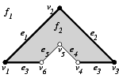
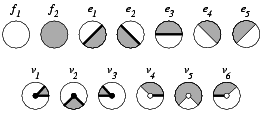

# CGAL支持的3D Boolean Operations on Nef Polyhedra
```https://doc.cgal.org/latest/Nef_3/index.html```

# Constructive Solid Geometry (CSG) 和 Boundary Representations (B-rep)
- 构造立体几何(CSG)和边界表示(B-rep)是实体建模的两种主要的表示方案，各有优劣
- CSG是一个树结构, 其叶节点是基本几何形状(primitive solids), 中间节点是布尔运算操作。
- CSG的布尔运算是封闭的，不会产生不属于 CSG 表示能力的新几何类型，但表达能力受基本几何形状的限制
- B-rep通过`边界`和`内外`决定了实体的形状。通过精确的数学表达、边界方程定义的曲面算B-rep，通过离散三角面片定义的也是B-rep.
- B-rep的表达能力受限于所选的曲面/曲线的类型、面边顶点的连接关系。
- B-rep的布尔运算是不封闭的，即使是流形三角网格，布尔运算后可能产生非流形结构
- **Nef多面体**结合了CSG和B-rep的优点。可以从半空间开始构建，也可以从可定向2-流形构建；布尔运算封闭，能够表达非流形结构在内的复杂几何形状。

# Nef Polyhedra定义
- $d$ 维空间下的Nef Polyhedra是一个由有限个数量的`半空间`通过`集合交`以及`集合补`运算得到的一组点集$P \subseteq \mathbb{Q}^d$。
- 由于并集、差集、对称差等运算可以归约为交和补运算，拓扑操作（边界、内部、外部等）也在这个建模空间内。

## a cone with apex $0$
- 如果点集$K \subseteq \mathbb{R}^d$ 满足 $K = \mathbb{R}^+K$ (从$K$中取任意一个点，对其施加一个正数，得到的点仍然在$K$以内)，那么这个$K$就叫<code>a cone with apex $0$</code>
- 如果满足$K=x+\mathbb{R}^+(K-x)$，就叫<code>a cone with apex $0$</code>
- 如果这样的锥$K$同时还是一个**多面体**（即由有限个半空间交集构成的点集），那么$K$就是一个`pyramid`。金字塔既满足多面体的性质，也要满足锥的无限性。

## 局部金字塔(local pyramids)
- 令$P \in \mathbb{R}^d$是一个多面体
- $x\in \mathbb{R}^d$是一个点
- $U_0(x)$表示$x$的一个邻域，即$x$为中心的一个足够小的空间范围；$U(x)$是$U_0(x)$的一个子集
- 金字塔$Q$定义为：$x+\mathbb{R}^+(P \cap U(x))-x)$。
  - $(P \cap U(x))$表示多面体$P$和$U(x)$相交的部分
  - 再减去$x$表示坐标系原点平移到点$x$，缩放后再加$x$，得到一个$x$附近的金字塔
- 如果对于任意的$U(x)$，得到的$Q$都是相同的，那么$Q$就是$P$在点$x$处的`local pyramid`, 记为$\text{Pyr}_{P}(x)$

> "局部金字塔"的"局部"指的是观察范围是局部，其本身还是一个无限延伸的空间。考虑三维的例子，$x$是原点，$U_0(x)$是原点为中心的一个半径较小的球体, $U(x)$是半径更小的一个球体。如果$P=\{(x,y,z):x\ge0, y\ge0, z\ge0\}$，此时$(P \cap U(x))$是一个$\frac{1}{8}$球体。$Q=\mathbb{R}^+(P \cap U(x))$就相当于将这个$\frac{1}{8}$球体无限延伸。

- 如果两个点$x,y$同属于一个面，当且仅当$\text{Pyr}_{P}(x)=\text{Pyr}_{P}(y)$

> 考虑一个立方体$P=[0,1]^3$。
> - 其顶面上的两个点$x_1=(0.3,0.5,1), x_2=(0.7,0.8,1)$，其局部金字塔都是**上半空间**$\{(x,y,z):z\ge0\}$,两点同属一个`二维面(面)`
> - 其边上两个点$x_1=(0.3,1,1), x_2=(0.7,1,1)$的局部金字塔是**90度的楔形**$\{(x,y,z):y\ge0,z\ge0\}$, 两者同属一个`一维面(边)`
> - 其顶点$(1,1,1)$的局部金字塔是**第一象限**，属于`零维面`。该立方体的每个顶点都属于一个单独的`零维面(点)`
> - 其内部的点，局部金字塔是整个$\mathbb{R}^3$
> - 其外部的点，局部金字塔为$\emptyset$

### 二维平面上的一个例子
给定以下5个半平面：
$$
h_1: y \ge 0 \quad h_2: x-y \ge 0 \quad h_3: x+y \le 3 \quad h_4:x-y \ge 1 \quad h_5: x+y \le 2
$$

则图中的多边形区域可以定义为:
$$
P:(h_1 \cap h_2 \cap h_3) - (h_4 \cap h_5)
$$

<div style="display: flex; gap: 20px; flex-wrap: nowrap; justify-content: center; align-items: flex-start;">
  <div style="text-align: center;">
    
    <div style="margin-top: 8px; font-size: 0.9em; color: #666;">二维Nef多面体</div>
  </div>
  
  <div style="text-align: center;">
    
    <div style="margin-top: 8px; font-size: 0.9em; color: #666;">各个"面"的局部金字塔</div>
  </div>
</div>