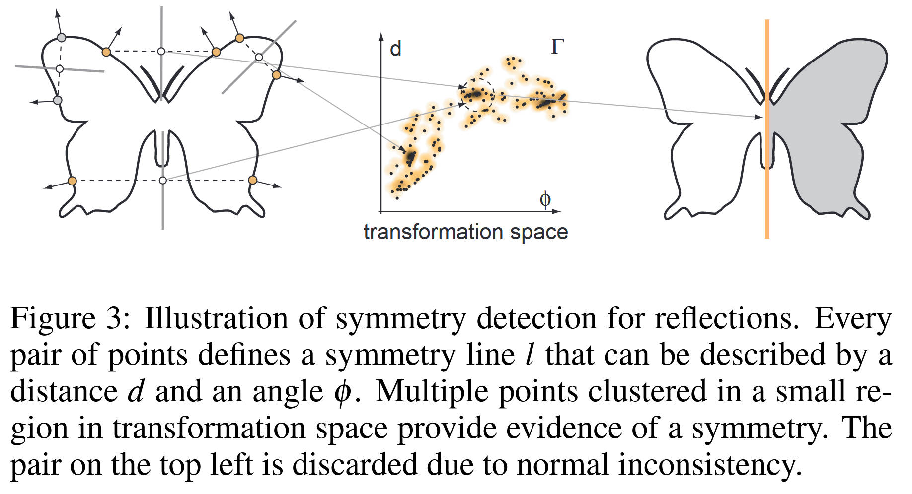

# Partial and Approximate Symmetry Detection for 3D Geometry

<a href="https://faculty.runi.ac.il/arik/seminar2010/papers/symmetry/symmetry_approx_sig_06.pdf" target="_blank">本文地址</a>

!!! note "对称性"
    本文的**对称**指的是在**旋转**、**镜像**、**缩放**变换下的不变性。
    本文的目标也是通过算法提取局部的对称性，允许近似、部分缺损的情况。

    文章算法分为两个步骤。
    
    在第一个步骤中，算法在形状表面计算一组点集上的`形状描述子`，通过这个`descriptor`，可以将点与点进行配对。这些配对会在表面形成一个"质量分布"(高密度区域)，用于描述局部表面的一个特征。

    在第二个步骤中，算法通过对"质量分布"进行聚类，以确定对称区域。

    最后，算法得到一个"对称图"结构。

## 算法核心
以二维情况为例，对于figure 3中的二维蝴蝶形状，其边界上任意点$(\mathbb{p},\mathbb{q})$，都可以通过其角平分线$(\mathbb{p}+\mathbb{q})/2$来定义一个反射的关系，这条角平分线的法向为$\mathbb{p}-\mathbb{q}$。这样的平分线就是一个`evidence`。通过观察所有的点对，就能积累这些`evidence`并提取相关的对称性。

    

## 对称性提取的主要流程
   - 表面点采样，得到点集$P$
   - 为$P$的每个点$p_i\in P$计算一个**本地签名**(local signature)
   - 如果$p_i,p_j$的签名相似，则将它们结对，并计算一个变换空间$\Gamma$，$\Gamma$可以将$p_i$映射到$p_j$
   - 在变换空间$\Gamma$下聚类，得到$P$的一个子集。这个子集在特定变换下保持不变性。

!!! note "本地签名"
    描述点周围局部几何特征的一组数值。具体来说，通常是一个特征向量，例如：曲率、法向量、邻域等。

!!! note "变换空间"
    指所有可能的变换的集合。对于点对$p_i,p_j$，算法计算变换$\tau$，使得$\Tau (p_i)=p_j$。这个变换就是变换空间$\Gamma$下的一个点。

## 签名(Signature)
签名实际上就是给定一组点，确定能够让这组点保持不变性的一组变换。这些变换包括平移、旋转、反射、放缩等。
虽然两个点能够确定反射变换，但两个点提供的自由度无法确定其他类型的变换。

算法转而为每个顶点计算一个"几何签名"，利用**normal cycle**的概念，通过[Alliez at al. 2003]的方法来近似在每个点$\mathbf{p}_i$上计算**曲率张量**。

算法在以$\mathbf{p}_i$为中心，$r$为半径的球体内计算曲率张量，计算积分主曲率$\kappa_{i,1}$和$\kappa_{i,2}$以及对应的主方向$\mathbf{c}_{i,1}$和$\mathbf{c}_{i,2}$.

半径$r$的选取很重要。$r$应该和采样间距相当，这样可以在计算曲率张量时实现充分的平均化，避免对采样点具体位置的强依赖性。

## 如何计算变换$\mathbf{T}_{ij}$？
- 根据主曲率，定义一个局部坐标系$(\mathbf{c}_{i,1}, \mathbf{c}_{i,2}, \mathbf{n}_i)$
- 根据$\mathbf{n}_i,\mathbf{n}_j$的共同平面确定变换$\mathbf{T}_{i,j}$的旋转$\mathbf{R}_{ij}$
- 根据主曲率确定放缩量$s_{ij}=(\kappa_{i,1}/\kappa_{j,1}+\kappa_{i,2}/\kappa_{j,2})/2$
- 已知旋转和放缩以及点$i,j$的位置，可轻易得到平移量 
- 于是，给定两个点$\mathbf{p}_i,\mathbf{p}_j$，可以得到一个7维的变换空间$\Gamma=\mathbf{T}_{ij}=(s_{ij}, R^x_{ij}, R^y_{ij}, R^z_{ij}, t^x_{ij}, t^y_{ij}, t^z_{ij})$, 这里$R^x_{ij}, R^y_{ij}, R^z_{ij}$是根据$\mathbf{R}_{ij}$分解得到的欧拉角。

## Point Pruning(点修剪)
- 只保留主曲率比较明显的点，要求两个主曲率比值足够大

## 如何计算7维特征
