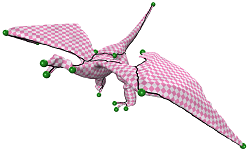

---
hide:
  - toc
  - navigation
---

<!-- Tianyu Zhu (朱天宇) - Homepage -->

  

    
  

  

    <h2 style="margin-top: 0; margin-bottom: 10px;">Tianyu Zhu (朱天宇)</h2>
    
    
<strong>Affiliation:</strong>

    <ul>
      <li><a href="http://gcl.ustc.edu.cn/">Graphics & Geometric Computing Laboratory</a></li>
      <li><a href="http://en.ustc.edu.cn/">University of Science and Technology of China (USTC)</a></li>
    </ul>
    
    
<strong>Location:</strong>

    

      Room 1314, Management and Research Building 
      East Campus, University of Science and Technology of China 
      Hefei, Anhui, 230026, P.R.China
    

    
    
<strong>Email:</strong> sa615162@mail.ustc.edu.cn

  

---

## Biography

I am currently a third-year master student at <a href="http://en.ustc.edu.cn/">University of Science and Technology of China</a>, supervised by <a href="http://staff.ustc.edu.cn/~fuxm">Dr. Xiao-Ming Fu</a> and <a href="http://staff.ustc.edu.cn/~zhuang">Dr. Zhangjin Huang</a>.

I received my Bachelor of Engineering from <a href="http://english.njust.edu.cn">Nanjing University of science and technology</a> in 2015.

## Research Interests

Parameterizations, Fabrication etc.

## Publications

### Greedy Cut Construction for Parameterizations

  
  

    
<strong>Title:</strong> <a href="https://rec.ustc.edu.cn/share/a1844790-544d-11ea-9b22-35d6c31fb227/">Greedy Cut Construction for Parameterizations</a>

    
<strong>Authors:</strong> <a href="https://mizuki7fan.github.io/">Tianyu Zhu</a>, <a href="https://chunyangye.github.io/">Chunyang Ye</a>, <a href="https://kfckfckf.github.io/">Shuangming Chai</a>, <a href="http://staff.ustc.edu.cn/~fuxm">Xiao-Ming Fu</a>

    
<strong>Venue:</strong> Computer Graphics Forum (Eurographics), 2020

  

<strong>Resources:</strong>

<ul>
  <li><a href="https://github.com/Mizuki7fan/GreedyCut">Code</a></li>
  <li><a href="https://rec.ustc.edu.cn/share/738da010-a46d-11ea-bfde-5b959c597b17">Slide</a></li>
</ul>

---

*Last updated: 2026-03-22*
