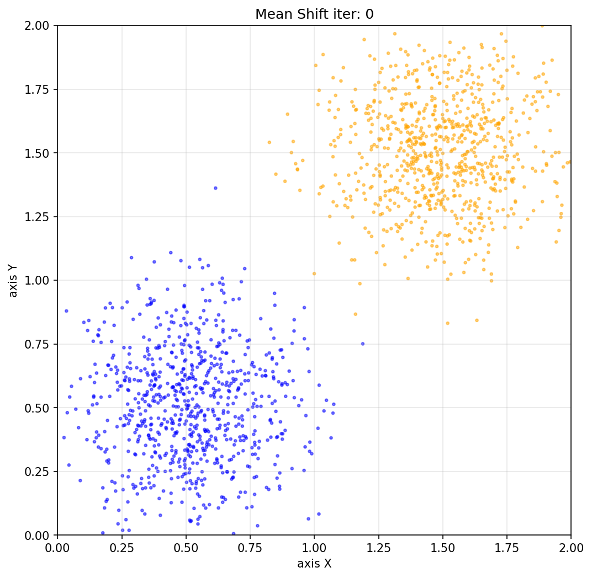
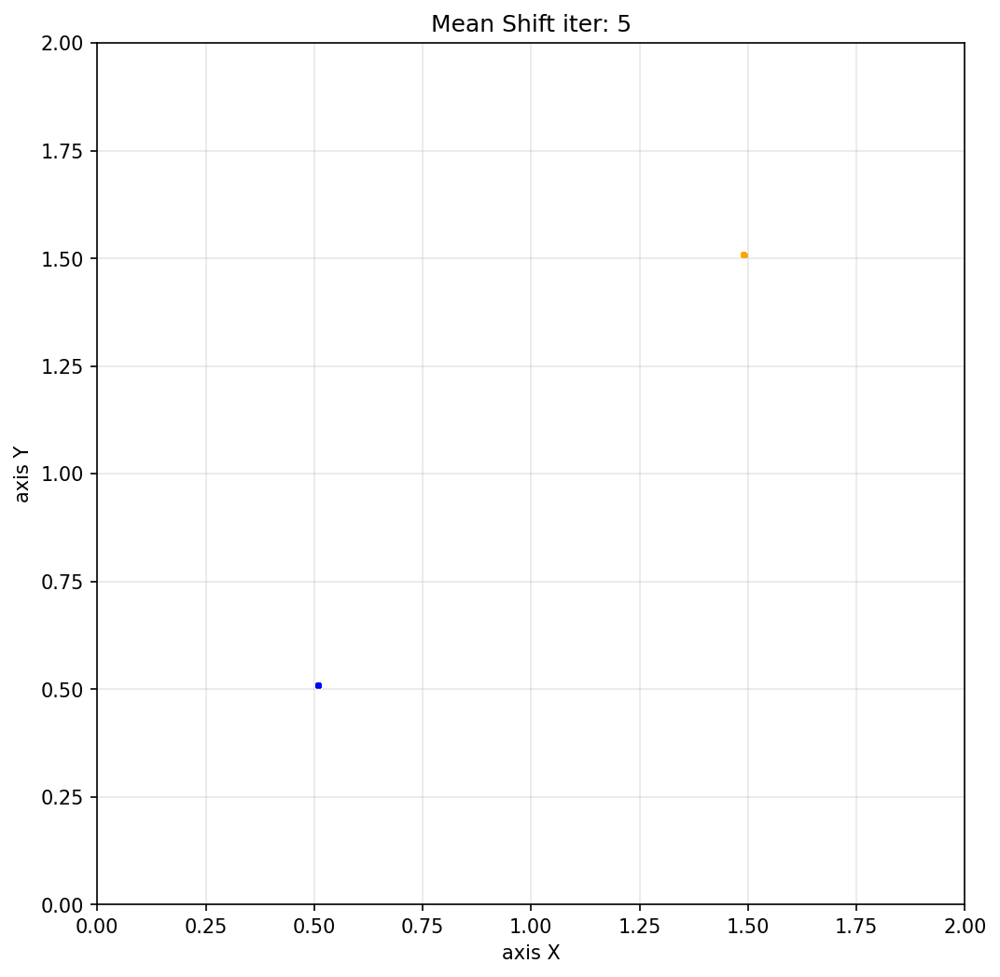

# 均值漂移聚类 (Mean Shift Clustering)

均值漂移（Mean Shift）是一种基于密度的非参数聚类算法，主要用于寻找**概率密度函数**的局部极大值。该算法最早由 Fukunaga 和 Hostetler 在 1975 年提出。

## 1. 核心原理 (Principle)

均值漂移的核心思想是**寻找数据分布的密度峰值**。

算法将特征空间中的数据点视为从某个概率密度函数中采样得到的经验样本，数据密集的区域对应于概率密度的局部极大值。

均值漂移算法通过迭代的方式，将每个数据点（或滑动窗口的中心）沿着密度增加最快的方向（即概率密度梯度的方向）移动，最终收敛到密度峰值点。收敛到同一个峰值点的数据点被划分到同一个聚类簇中。

### 核密度估计 (Kernel Density Estimation, KDE)
均值漂移算法在底层依赖于核密度估计来平滑数据并估计潜在的概率密度。
- **核函数 (Kernel Function)**：用于决定邻域内数据点的权重，常用的有高斯核（Gaussian Kernel）和均匀核（Flat/Uniform Kernel）。距离中心越近的点，其权重通常越大。
- **带宽 (Bandwidth, $h$)**：核函数的一个关键参数，决定了搜索窗口的大小（即作用范围）。带宽决定了密度估计的平滑程度，是均值漂移算法中最重要的超参数。

## 2. 算法流程 (Process)

均值漂移算法的执行是一个不断寻找局部密度最大值的迭代过程（Mode-seeking）。具体步骤如下：

1. **初始化**：
   - 设定核函数的带宽 $h$（窗口大小）。
   - 将数据集中的每个点（或随机选择的子集）作为初始的滑动窗口中心 $x$。

2. **计算均值漂移向量 (Mean Shift Vector)**：
   - 对于当前的窗口中心 $x$，找出其带宽 $h$ 邻域内的所有数据点 $x_i$。
   - 计算这些邻域点相对于中心点 $x$ 的加权平均位置。权重由核函数计算得出。
   - **均值漂移向量** $m(x)$ 定义为这个加权平均位置与当前中心点 $x$ 的差向量。在数学上，这个向量被证明与概率密度函数的梯度成正比，因此它总是指向数据密度增加最快的方向。

3. **更新窗口中心 (平移窗口)**：
   - 将窗口中心沿着均值漂移向量的方向移动：$x \leftarrow x + m(x)$。

4. **迭代与收敛**：
   - 重复步骤 2 和 3，不断更新窗口中心。
   - 当均值漂移向量的大小接近于 0（即窗口中心不再发生显著移动，达到设定的容差阈值）时，迭代停止。此时，窗口中心收敛到了一个局部密度峰值（Mode）。

5. **聚类划分**：
   - 对所有初始点执行上述迭代过程。
   - 将最终收敛到同一个（或距离非常接近的）局部密度峰值的所有初始点，划分到同一个聚类簇中。

## 3. 算法特点

**优点**：
- **无需预设聚类数**：与 K-Means 不同，不需要事先指定聚类簇的数量 $K$，算法会根据数据分布自动确定。
- **适应任意形状**：能够处理非凸形状、任意形状的聚类。
- **对异常值鲁棒**：异常值通常位于低密度区域，不会吸引窗口中心，因此对噪声和异常值相对不敏感。

**缺点**：
- **计算成本高**：标准的均值漂移算法需要计算所有点对之间的距离，时间复杂度较高（接近 $O(N^2)$），在大规模数据集上运行缓慢。
- **对带宽参数敏感**：聚类结果高度依赖于带宽 $h$ 的选择。带宽过大可能导致不同的簇合并，带宽过小可能导致一个簇被过度分割。在高维空间中，选择合适的带宽尤为困难。

## 4. helloworld.py

在$[0,2]^2$区域内, 分别以$(0.5, 0.5)$和$(1.5, 1.5)$为中心, 按照正态分布进行随机撒点, 之后进行均值漂移聚类

```python
import numpy as np
import matplotlib.pyplot as plt
import matplotlib
import os
import shutil

def init_data():
    """初始化数据集，返回点坐标和颜色信息"""
    # 设置随机种子以保证结果可重现
    np.random.seed(42)

    # 生成数据集
    num_points = 2000

    # 前800个点：以(0.5,0.5)为中心的正态分布
    mean1 = [0.5, 0.5]
    cov1 = [[0.05, 0], [0, 0.05]]  # 协方差矩阵，控制分布的紧凑程度
    points1 = np.random.multivariate_normal(mean1, cov1, 800)

    # 后800个点：以(1.5,1.5)为中心的正态分布
    mean2 = [1.5, 1.5]
    cov2 = [[0.05, 0], [0, 0.05]]
    points2 = np.random.multivariate_normal(mean2, cov2, 800)

    # 合并所有点
    all_points = np.vstack([points1, points2])

    # 构建颜色标签数组，区分不同来源的点
    colors = (
        ['blue'] * len(points1) +    # cluster1 用蓝色
        ['orange'] * len(points2)  # cluster2 用橙色
    )

    print(f"数据集已生成，共{len(all_points)}个点")
    print(f"数据范围: x∈[{all_points[:,0].min():.2f}, {all_points[:,0].max():.2f}], "
          f"y∈[{all_points[:,1].min():.2f}, {all_points[:,1].max():.2f}]")

    return all_points, colors


def gaussian_kernel(point, all_points, bandwidth):
    # 计算当前点与所有点的欧几里得距离
    distances = np.linalg.norm(all_points - point, axis=1)

    # 使用高斯核计算权重，距离超出带宽范围的点权重截断为0
    weights = np.exp(-distances ** 2 / (2 * bandwidth ** 2))
    weights[distances > bandwidth] = 0.0

    # 若邻域内无点（权重全为0），则保持原位
    weight_sum = weights.sum()
    if weight_sum == 0:
        return point

    # 按权重对邻域内所有点求加权均值，作为新位置
    new_point = (weights[:, np.newaxis] * all_points).sum(axis=0) / weight_sum
    return new_point


def save_plot(points, colors, iteration, result_dir='result'):
    """
    将当前点分布保存为图片。

    参数：
        points: 当前所有点坐标 (N, 2)
        colors: 各点颜色列表
        iteration: 当前迭代次数（0表示初始状态）
        result_dir: 输出目录
    """
    fig, ax = plt.subplots(figsize=(8, 8))
    ax.scatter(points[:, 0], points[:, 1], c=colors, alpha=0.5, s=5)
    ax.set_xlim(0, 2)
    ax.set_ylim(0, 2)
    ax.set_xlabel('axis X')
    ax.set_ylabel('axis Y')
    ax.set_title(f'Mean Shift iter: {iteration}')
    ax.grid(True, alpha=0.3)

    save_path = os.path.join(result_dir, f'dist_{iteration}.png')
    plt.savefig(save_path, dpi=150, bbox_inches='tight')
    plt.close(fig)
    print(f"已保存: {save_path}")


def meanshift(all_points, colors, bandwidth=0.3, max_iter=300, convergence_threshold=1e-3, merge_threshold=0.1):
    """
    对所有点执行 Mean Shift 聚类迭代。

    参数：
        all_points: 初始点坐标 (N, 2)
        colors: 各点颜色列表
        bandwidth: 核函数带宽
        max_iter: 最大迭代次数
        convergence_threshold: 收敛阈值（单点位移小于此值视为收敛）
        merge_threshold: 聚类中心合并阈值

    返回：
        cluster_centers: 最终聚类中心列表
        labels: 每个点所属聚类的标签
    """
    # 当前所有点的位置（副本，避免修改原始数据）
    current_points = all_points.copy()
    n_points = len(current_points)

    # 保存初始状态图片 dist_0.png
    result_dir = 'result'
    if os.path.exists(result_dir):
        shutil.rmtree(result_dir)
    os.makedirs(result_dir)
    save_plot(current_points, colors, iteration=0, result_dir=result_dir)

    for iteration in range(1, max_iter + 1):
        new_points = np.zeros_like(current_points)
        max_shift = 0.0

        # 对每个点独立执行均值漂移
        for i in range(n_points):
            new_pos = gaussian_kernel(current_points[i], current_points, bandwidth)
            shift = np.linalg.norm(new_pos - current_points[i])
            max_shift = max(max_shift, shift)
            new_points[i] = new_pos

        current_points = new_points

        # 每轮迭代后保存图片
        save_plot(current_points, colors, iteration=iteration)

        print(f"迭代 {iteration}/{max_iter}，最大位移: {max_shift:.6f}")

        # 当所有点的位移量均小于收敛阈值时停止
        if max_shift < convergence_threshold:
            print(f"已收敛，共迭代 {iteration} 次")
            break
    else:
        print(f"警告：达到最大迭代次数 {max_iter}，算法未完全收敛")

    # 将距离相近的收敛点合并为同一聚类中心
    cluster_centers = []
    labels = np.full(n_points, -1, dtype=int)

    for i in range(n_points):
        point = current_points[i]
        assigned = False
        for j, center in enumerate(cluster_centers):
            if np.linalg.norm(point - center) < merge_threshold:
                labels[i] = j
                assigned = True
                break
        if not assigned:
            labels[i] = len(cluster_centers)
            cluster_centers.append(point)

    return cluster_centers, labels


def main():
    # 初始化数据，获取点坐标和颜色信息
    all_points, colors = init_data()

    # 执行 Mean Shift 聚类
    cluster_centers, labels = meanshift(all_points, colors, bandwidth=0.5, merge_threshold=0.5)

    # 打印最终聚类中心坐标和各类点数量
    print(f"\n最终聚类结果：共 {len(cluster_centers)} 个聚类中心")
    for i, center in enumerate(cluster_centers):
        count = np.sum(labels == i)
        print(f"  聚类 {i+1}: 中心坐标 ({center[0]:.4f}, {center[1]:.4f})，包含 {count} 个点")


if __name__ == '__main__':
    main()
```

<div style="display: flex; gap: 20px; flex-wrap: nowrap; justify-content: center; align-items: flex-start;">
  <div style="text-align: center;">
    
    <div style="margin-top: 8px; font-size: 0.9em; color: #666;">初始散点位置</div>
  </div>
  
  <div style="text-align: center;">
    
    <div style="margin-top: 8px; font-size: 0.9em; color: #666;">聚类结果</div>
  </div>
</div>
